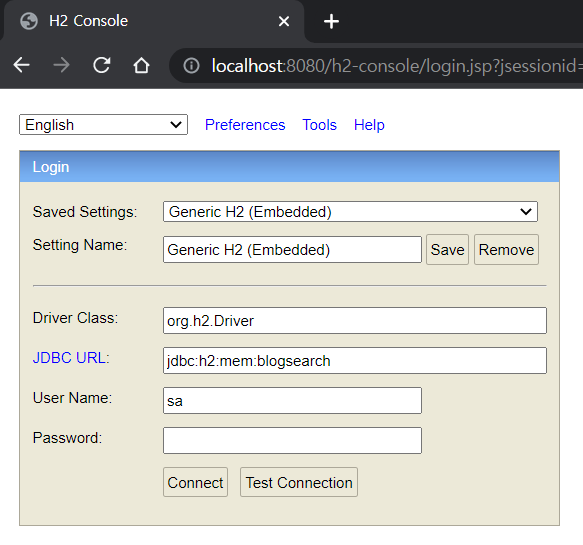

# BlogSearch

## Description
This is a blog search service. 
By using this system, you can easily search blogs in 'Daum' or 'Naver' platform.
Also, this system provides you top 10 most viewed keywords list.

## Prerequisite
- Java 11+

## Download & Guide Link
- Executable Jar: 
- API Guide: 

## How to Load Service?
Run Executable Jar:

    java -jar runExecutableJar

Access to http://localhost:8080/h2-console/login.jsp

 

## Spec
- SpringBoot 2.6.7
- Java 11
- Kotlin 1.7.22
- Gradle 7.6.1
- H2 Database
- Spring Data JPA
- JUnit
